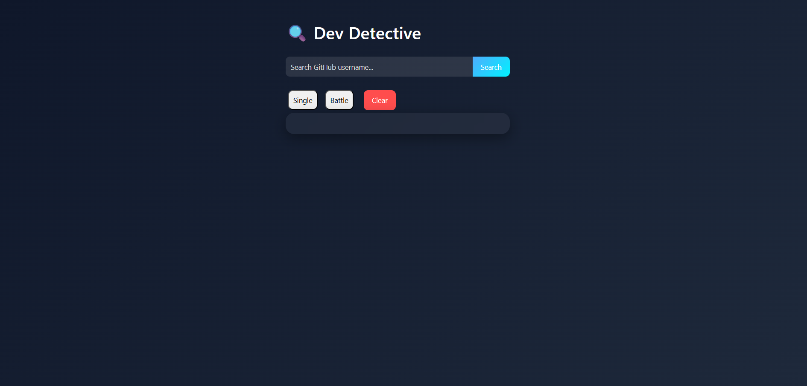
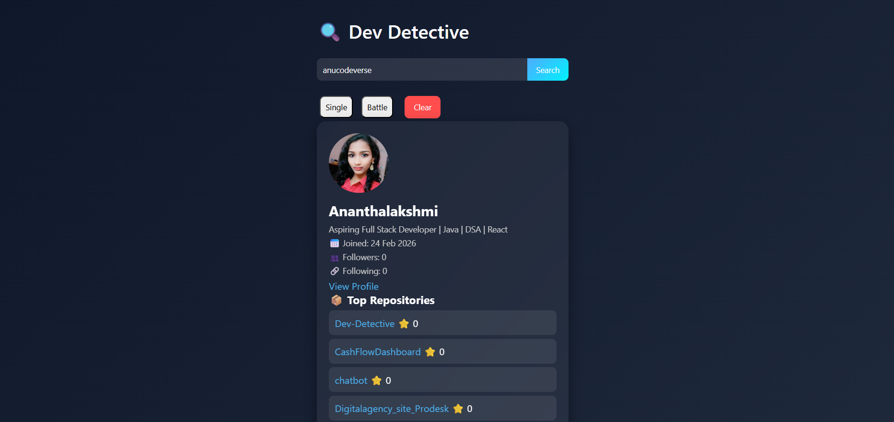
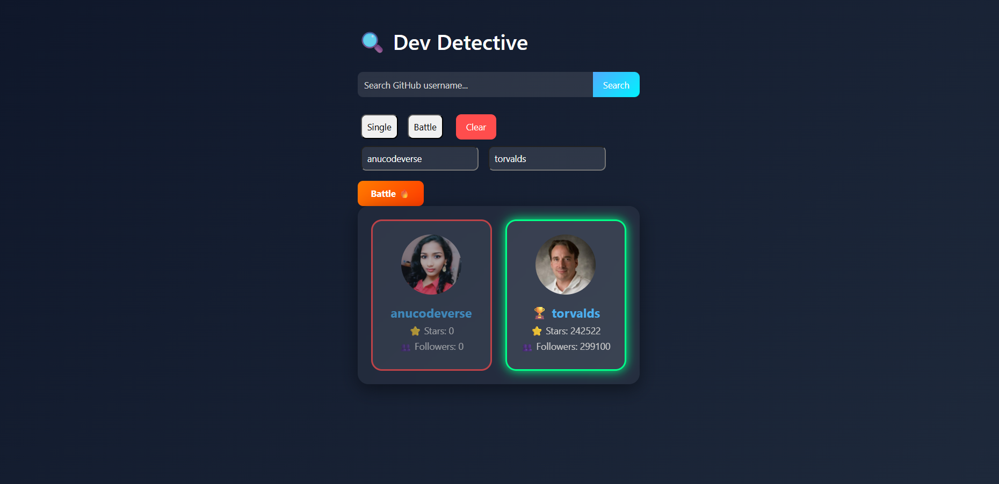

Dev-Detective

#Overview

Dev Detective is a responsive web application that allows users to search for any GitHub profile and view detailed information in a clean and interactive UI. It also includes a Battle Mode feature where two GitHub users can be compared based on their repository stars.

This project focuses on working with real-world APIs, handling asynchronous JavaScript using async/await, and building dynamic UI updates using DOM manipulation.

🚀 Features
🔎 Single User Search
Search any GitHub username
Display:
Profile image
Name
Bio
Join date
Followers & Following
Profile link (clickable)
Show top 5 latest repositories
Each repository is clickable
Battle Mode

#Compare two GitHub users
Fetch data simultaneously using Promise.all
Calculate total stars from all repositories
Display:
Winner 🏆 (highlighted in green)
Loser (highlighted in red)
Show Tie 🤝 if both are equal
Both profiles are clickable

##Loading & Error Handling
Displays Loading... while fetching data
Shows User Not Found for invalid usernames

#Prevents UI crashes
Clear Functionality
Clears all inputs
Resets UI to default mode
Hides profile and battle results

# UI Design
Clean and modern interface
Glassmorphism style cards
Responsive layout
Smooth hover effects and transitions

#Technologies Used
HTML5 – Structure
CSS3 – Styling, layout, animations
JavaScript (ES6) – Logic and DOM manipulation
GitHub REST API – Fetching real-time user data

🔗 API Used
https://api.github.com/users/{username}

📸 Screenshots
🔎 Search Mode

⚔️ Battle Mode

📂 Project Structure
Dev-Detective/

│── index.html      
→ Main structure
│── style.css   
→ UI styling
│── script.js    
→ Application logic
│── images/  
→ Screenshots
│── README.md

#How to Run the Project
Clone the repository:
https://github.com/anucodeverse/dev-detective
Open the project folder
Run the project:
Open index.html in your browser

#Live Demo
(Add your deployed link here — Netlify / GitHub Pages)

#Technical Learnings
Working with APIs using fetch()
Using async/await for asynchronous operations
Handling JSON data
Managing multiple API calls using Promise.all
DOM manipulation and dynamic UI rendering
Error handling and loading states
Building interactive features like Battle Mode

#Challenges Faced
Handling multiple API calls efficiently
Avoiding duplicate rendering issues
Managing UI state between search and battle modes
Calculating total stars from repositories
Designing clean and responsive UI

 #Future Improvements
Add dark/light mode toggle
Add loading spinner animation
Improve mobile responsiveness
Add more comparison metrics (followers, repos, etc.)
Add search history feature

 Note:
This project is built using pure HTML, CSS, and JavaScript without any frameworks.
The goal is to strengthen core frontend development skills and understand how real-world applications interact with APIs.

 Author
ANANTHALAKSHMI
GitHub: https://github.com/anucodeverse

